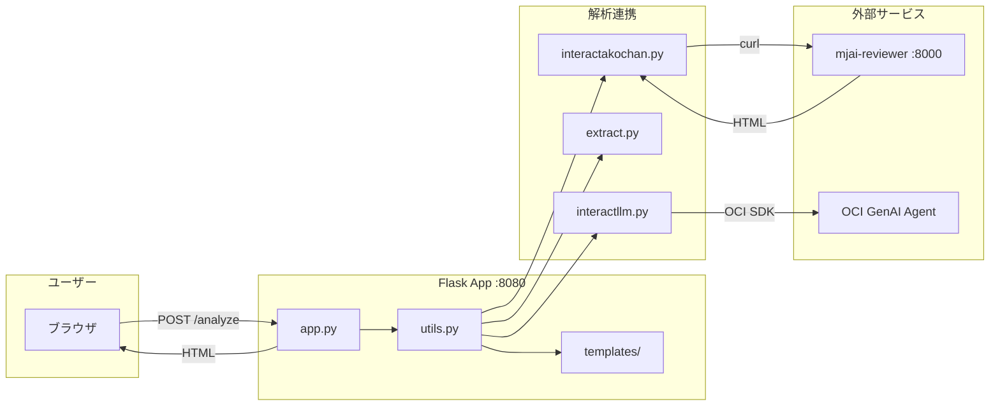
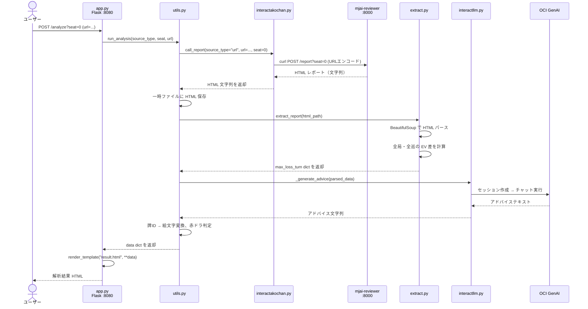

# Mahjong-Coaching2 バックエンド — コード詳細解説

## 1. プロジェクト概要

麻雀AI「Akochan」の解析エンジン（mjai-reviewer）と連携し、ユーザーの牌譜を解析して **最大ロスの巡** を特定し、OCI Generative AI によるアドバイスを付与して結果を表示する Web アプリケーション。



---

## 2. ディレクトリ構成

```
backend/
├── app.py                  # Flask アプリケーション本体
├── utils.py                # 処理オーケストレーション
├── interactakochan.py      # akochan サーバー連携（curl）
├── _interactakochan.py     # 旧版アーカイブ（使用されていない）
├── extract.py              # HTML レポートパーサー
├── interactllm.py          # OCI GenAI Agent 連携
├── get_and_parse.py        # CLI テストツール（Flask app を叩く）
├── prompt.txt              # LLM 用プロンプトテンプレート
├── requirements.txt        # Python 依存パッケージ
├── source/                 # テスト用 JSON ファイル
│   ├── replay.json
│   └── test.json
└── templates/
    ├── index.html           # 入力フォーム画面
    ├── result.html          # 解析結果表示画面
    └── error.html           # エラー画面
```

---

## 3. 処理フロー（エンドツーエンド）



---

## 4. 各ファイル詳細解説

---

### 4.1 [app.py](file:///c:/Users/champ/20260824_分科会/Mahjong-Coaching2/backend/app.py) — Flask アプリケーション

Flask のルーティングとエラーハンドリングを担当。

#### ルート一覧

| メソッド | パス | 関数 | 説明 |
|---|---|---|---|
| GET | `/` | `index()` | 入力フォーム画面を表示 |
| GET/POST | `/analyze` | `analyze()` | 牌譜解析のメインエンドポイント |
| GET/POST | `/error` | `error()` | テスト用 500 エラー発生 |

#### [analyze()](file:///c:/Users/champ/20260824_分科会/Mahjong-Coaching2/backend/app.py#L12-L68) の処理詳細

1. **`seat` パラメータ取得** (L14-16)
   - クエリパラメータ `?seat=N` を取得（デフォルト `"0"`）
   - `0〜3` 以外なら 400 エラー

2. **`source_type` 判定** (L18-27)
   - 明示的に指定がない場合、以下の優先順で自動判別：
     - `url` パラメータがあれば `"url"`
     - リクエストが JSON なら `"json"`
     - ファイルアップロードがあれば `"file"`
     - いずれもなければ 400 エラー

3. **入力データ抽出** (L29-49)
   - `source_type` に応じて `url` / `file_content` / `json_body` を取得
   - 各ソースのバリデーション（空チェック等）

4. **解析実行** (L51-58)
   - `utils.run_analysis()` を呼び出し
   - 成功時は `render_template("result.html", **data)` で結果表示
   - `ValueError` → 400、その他の例外 → 500 でエラー画面表示

#### エラーハンドラ (L80-107)

| ステータス | 関数 | エラーメッセージ |
|---|---|---|
| 404 | `page_not_found()` | ページが見つかりません |
| 400 | `bad_request()` | 不正なリクエストです |
| 500 | `internal_server_error()` | サーバーエラーが発生しました |

#### エントリポイント (L110-112)

```python
if __name__ == "__main__":
    port = int(os.environ.get("PORT", "8080"))
    app.run(host="0.0.0.0", port=port)
```

- 環境変数 `PORT` でポート指定可能（デフォルト 8080）

---

### 4.2 [utils.py](file:///c:/Users/champ/20260824_分科会/Mahjong-Coaching2/backend/utils.py) — 処理オーケストレーション

解析パイプライン全体を制御する中核モジュール。

#### インポート

```python
import extract            # HTML パーサー
import interactakochan    # akochan 連携
import interactllm        # LLM 連携
```

#### ユーティリティ関数

##### [write_temp_file(suffix, content)](file:///c:/Users/champ/20260824_分科会/Mahjong-Coaching2/backend/utils.py#L12-L15)

```python
def write_temp_file(suffix: str, content: bytes) -> Path
```

- `tempfile.NamedTemporaryFile` で一時ファイルを作成
- `content` (bytes) を書き込み、`Path` を返却
- **用途**: file/json アップロード時に一時保存

##### [remove_file(path)](file:///c:/Users/champ/20260824_分科会/Mahjong-Coaching2/backend/utils.py#L18-L24)

```python
def remove_file(path: Path | None) -> None
```

- `None` の場合はスキップ、`OSError` を無視して削除
- **用途**: `finally` ブロックで一時ファイルのクリーンアップ

##### [convert_tile_detail(tile_str)](file:///c:/Users/champ/20260824_分科会/Mahjong-Coaching2/backend/utils.py#L27-L76)

```python
def convert_tile_detail(tile_str: str | None) -> dict[str, Any]
```

牌の文字列ID（例: `"5mr"`, `"1z"`, `"3p"`）を Unicode 麻雀絵文字に変換。

- **赤ドラ判定**: 末尾 `"r"` があれば `is_red = True`
- **字牌マップ**: `ton`/`1z` → 🀀、`haku`/`5z` → 🀆 など
- **数牌変換**: Unicode コードポイント計算
  - 萬子: `0x1F007 + (num - 1)`
  - 索子: `0x1F010 + (num - 1)`
  - 筒子: `0x1F019 + (num - 1)`
- **返却値**: `{"emoji": "🀇", "is_red": False}`

#### [run_analysis()](file:///c:/Users/champ/20260824_分科会/Mahjong-Coaching2/backend/utils.py#L79-L156) — メイン解析関数

```python
def run_analysis(
    source_type: str,
    seat: int,
    url: str | None = None,
    file_content: bytes | None = None,
    json_body: bytes | None = None
) -> dict[str, Any]
```

**処理ステップ:**

1. **akochan へリクエスト送信** (L89-104)
   - `source_type` に応じて `interactakochan.call_report()` を呼び出し
   - file/json の場合は事前に `write_temp_file()` で一時ファイル化
   - 返却値: HTML 文字列（akochan のレポート）

2. **HTML レポート解析** (L106-109)
   - 返却 HTML を一時ファイルに保存
   - `extract.extract_report(html_path)` でパース
   - 返却値: `{"max_loss_turn": {...}}` または `{}`

3. **LLM アドバイス生成** (L112)
   - `interactllm._generate_advice(parsed_data)` を呼び出し
   - OCI GenAI Agent からアドバイステキストを取得

4. **結果データ組み立て** (L114-150)
   - `max_loss_turn` から局・巡目・手牌・打牌・ロス値を抽出
   - 一時的に `data.json` に保存後、再読み込み（デバッグ用と思われる）
   - `convert_tile_detail()` で手牌・打牌を絵文字に変換
   - 赤ドラフラグ (`player_is_red`, `ai_is_red`) を設定

5. **クリーンアップ** (L153-155)
   - `finally` ブロックで一時ファイルを確実に削除

**返却する dict の構造:**

```python
{
    "kyoku": "東1局",           # 局名
    "turn": 8,                  # 巡目
    "tehai_data": [             # 手牌（絵文字＋赤ドラフラグ）
        {"emoji": "🀇", "is_red": False},
        ...
    ],
    "player_discard": "🀈",     # プレイヤーの打牌（絵文字）
    "player_is_red": False,     # プレイヤー打牌が赤ドラか
    "ai_discard": "🀉",        # AI 推奨打牌（絵文字）
    "ai_is_red": False,         # AI 推奨打牌が赤ドラか
    "loss": 0.0123,             # 期待値ロス
    "commentary": "..."         # LLM アドバイス
}
```

---

### 4.3 [interactakochan.py](file:///c:/Users/champ/20260824_分科会/Mahjong-Coaching2/backend/interactakochan.py) — akochan サーバー連携

外部の mjai-reviewer サーバー（port 8000）に curl で POST リクエストを送信し、HTML レポートを取得する。

#### 定数

```python
RESULT_DIR = Path(__file__).resolve().parent / "result"      # CLI 実行時の出力先
SOURCE_DIR = Path(__file__).resolve().parent / "source"      # JSON ソースの相対パス解決用
DEFAULT_ENDPOINT = os.environ.get("MJAI_REVIEWER_ENDPOINT", "http://localhost:8000/report")
```

#### 関数一覧

##### [resolve_json_path(path)](file:///c:/Users/champ/20260824_分科会/Mahjong-Coaching2/backend/interactakochan.py#L16-L20)

```python
def resolve_json_path(path: str) -> Path
```

- 絶対パスならそのまま返す
- 相対パスなら `SOURCE_DIR` を基準に解決

##### [build_parser()](file:///c:/Users/champ/20260824_分科会/Mahjong-Coaching2/backend/interactakochan.py#L23-L31)

```python
def build_parser() -> argparse.ArgumentParser
```

CLI 用の引数パーサーを構築。

| 引数 | 型 | デフォルト | 説明 |
|---|---|---|---|
| `--file` | str | なし | アップロードする JSON ファイルパス |
| `--json` | str | なし | JSON ボディファイルパス |
| `--url` | str | なし | 天鳳牌譜 URL |
| `--seat` | int | 0 | 席番号（0〜3） |
| `--endpoint` | str | `http://localhost:8000/report` | エンドポイント URL |

##### [_run_command(command)](file:///c:/Users/champ/20260824_分科会/Mahjong-Coaching2/backend/interactakochan.py#L34-L43)

```python
def _run_command(command: list[str]) -> str
```

- 実行するコマンドを標準出力に表示（`print("Running:", ...)`）
- `subprocess.run()` でコマンド実行（`capture_output=True`）
- stdout を UTF-8 デコードして返却
- 失敗時は `RuntimeError` を raise（stdout/stderr を含むメッセージ）

##### [_build_curl_command(source_type, source, seat, endpoint)](file:///c:/Users/champ/20260824_分科会/Mahjong-Coaching2/backend/interactakochan.py#L46-L57)

```python
def _build_curl_command(source_type: str, source: str | None, seat: int, endpoint: str) -> list[str]
```

curl コマンドの引数リストを構築:

| source_type | 構築されるコマンド |
|---|---|
| `"url"` | `curl -X POST {endpoint}?seat=N -G --data-urlencode source_type=url --data-urlencode url=...` |
| `"file"` | `curl -X POST {endpoint}?seat=N -F file=@...` |
| `"json"` | `curl -X POST {endpoint}?seat=N -H "Content-Type: application/json" --data-binary @...` |

##### [call_report()](file:///c:/Users/champ/20260824_分科会/Mahjong-Coaching2/backend/interactakochan.py#L60-L89) ⭐ 主要 API

```python
def call_report(
    source_type: str,
    file_path: str | None = None,
    json_path: str | None = None,
    url: str | None = None,
    seat: int = 0,
    endpoint: str | None = None,
) -> str
```

- **呼び出し元**: `utils.py` の `run_analysis()`
- `source_type` に応じて適切な source を選択
- `_build_curl_command()` でコマンド構築 → `_run_command()` で実行
- **返却値**: akochan が返した HTML 文字列

##### [run_curl(args)](file:///c:/Users/champ/20260824_分科会/Mahjong-Coaching2/backend/interactakochan.py#L92-L135) — CLI 用

```python
def run_curl(args: argparse.Namespace) -> int
```

- CLI 直接実行用（argparse の Namespace を受け取る）
- `call_report()` とは異なり、curl の `-o` オプションで結果を **ファイルに直接保存**
- 出力先: `result/{source_kind}-{timestamp}.html`
- 返却値: 終了コード（0=成功）

---

### 4.4 [extract.py](file:///c:/Users/champ/20260824_分科会/Mahjong-Coaching2/backend/extract.py) — HTML レポートパーサー

akochan が出力した HTML レポートを BeautifulSoup でパースし、最大ロスの巡を特定する。

#### 関数一覧

##### [get_tile_id(tag)](file:///c:/Users/champ/20260824_分科会/Mahjong-Coaching2/backend/extract.py#L12-L15)

```python
def get_tile_id(tag: Any) -> str | None
```

- SVG の `<use>` タグから `href` 属性を取得
- `#pai-` プレフィックスを除去して牌ID文字列を返す
- 例: `href="#pai-5mr"` → `"5mr"`

##### [extract_tiles(entry)](file:///c:/Users/champ/20260824_分科会/Mahjong-Coaching2/backend/extract.py#L19-L34)

```python
def extract_tiles(entry: Any) -> tuple[list[str], list[str]]
```

- `details.entry` 要素内の `ul.tehai-state` から全 `<use>` タグをスキャン
- 全牌の ID をリストとして返却
- 返却値: `(tehai_list, [])` — 副露は空リスト

##### [find_player_discard(entry)](file:///c:/Users/champ/20260824_分科会/Mahjong-Coaching2/backend/extract.py#L37-L56)

```python
def find_player_discard(entry: Any) -> str | None
```

プレイヤーの実際の打牌を HTML から抽出:

1. `"Player:"` または `"Akochan:"` で始まる `<span>` を検索
2. その中の `<use>` タグから牌ID を取得
3. フォールバック: `style` に `"background"` を含む `<span>` を検索

##### [get_kyoku_and_turn(entry)](file:///c:/Users/champ/20260824_分科会/Mahjong-Coaching2/backend/extract.py#L60-L71)

```python
def get_kyoku_and_turn(entry: Any) -> tuple[str, int]
```

- 親 `<section>` の `h1.kyoku-heading` から局名を取得
- `<summary>` テキストから `"Turn N"` をの正規表現で巡目を抽出

##### [get_ev_from_row(row)](file:///c:/Users/champ/20260824_分科会/Mahjong-Coaching2/backend/extract.py#L74-L85)

```python
def get_ev_from_row(row: Any) -> float
```

- テーブル行の2列目（`<td>`）から EV（期待値）を取得
- `<span class="int">` と `<span class="frac">` を結合して float 化

##### [extract_max_loss_turn(html_path)](file:///c:/Users/champ/20260824_分科会/Mahjong-Coaching2/backend/extract.py#L88-L145) ⭐ コアロジック

```python
def extract_max_loss_turn(html_path: str) -> dict[str, Any] | None
```

**処理:**

1. **HTML 読み込み** (L89-98)
   - `utf-8` → `utf-16` → `cp932` → `utf-8-sig` の順でエンコーディングを試行
   - どれも失敗すれば例外

2. **全局・全巡をスキャン** (L103-144)
   - `<section>` > `<details class="entry">` を走査
   - 各エントリで:
     - `<table class="data">` の `<tbody>` 内の行を取得
     - **1行目** = AI 最善手 → `ai_ev` を取得
     - **プレイヤー打牌** を `find_player_discard()` で特定
     - プレイヤー打牌と一致する行の EV を `player_ev` として取得
     - `loss = ai_ev - player_ev` を計算
     - 全エントリ中の最大 loss を記録

3. **返却値** (max_loss_data):
   ```python
   {
       "kyoku": "東1局",
       "turn": 8,
       "tehai": ["1m", "2m", ...],
       "player_discard": "5mr",
       "player_ev": 1200.5,
       "ai_discard": "3p",
       "ai_ev": 1350.2,
       "loss": 149.7
   }
   ```

##### [extract_report(html_path)](file:///c:/Users/champ/20260824_分科会/Mahjong-Coaching2/backend/extract.py#L148-L153)

```python
def extract_report(html_path: str) -> dict[str, Any] | None
```

- `extract_max_loss_turn()` のラッパー
- 結果を `{"max_loss_turn": {...}}` で包んで返却
- 結果なしの場合はエラーメッセージ dict を返却

---

### 4.5 [interactllm.py](file:///c:/Users/champ/20260824_分科会/Mahjong-Coaching2/backend/interactllm.py) — OCI GenAI Agent 連携

OCI Generative AI Agent Runtime SDK を使用して LLM にアドバイスを生成させる。

#### 定数

```python
AGENT_ENDPOINT_OCID = "ocid1.genaiagentendpoint.oc1.ap-osaka-1.amaaaaaapimhcliaa726mjt7r472vztwa2bb46egb6dmsbvtsdvtfcvve4ba"
REGION = "ap-osaka-1"
```

#### [_generate_advice(parsed_data)](file:///c:/Users/champ/20260824_分科会/Mahjong-Coaching2/backend/interactllm.py#L10-L47)

```python
def _generate_advice(parsed_data=None) -> str
```

**処理:**

1. **プロンプト読み込み** (L12-15)
   - `prompt.txt` を読み込み（麻雀コーチとしての指示文）

2. **OCI 認証** (L17)
   - `InstancePrincipalsSecurityTokenSigner` を使用
   - OCI インスタンスプリンシパル認証（VM 上での実行を想定）

3. **クライアント初期化** (L19-23)
   - `GenerativeAiAgentRuntimeClient` を大阪リージョンのエンドポイントで初期化

4. **セッション作成** (L26-32)
   - `create_session()` で新規セッションを作成
   - セッション ID を取得

5. **チャット実行** (L38-44)
   - `chat()` でプロンプト（`prompt.txt` の内容）を送信
   - **注意**: 現在の実装では `parsed_data` は使用されておらず、`prompt.txt` の固定テキストのみ送信

6. **返却値**: AI エージェントのレスポンステキスト

---

### 4.6 [get_and_parse.py](file:///c:/Users/champ/20260824_分科会/Mahjong-Coaching2/backend/get_and_parse.py) — CLI テストツール

**Flask app 自体 (port 8080 `/analyze`)** を curl で叩くための CLI ツール。

> [!IMPORTANT]
> `interactakochan.py` は **akochan サーバー (port 8000 `/report`)** を叩くのに対し、
> `get_and_parse.py` は **Flask app (port 8080 `/analyze`)** を叩きます。

#### 構造

`interactakochan.py` の `run_curl()` とほぼ同一の処理で、以下が異なります:

| | interactakochan.py | get_and_parse.py |
|---|---|---|
| デフォルトエンドポイント | `localhost:8000/report` | `localhost:8080/analyze` |
| 用途 | akochan への直接リクエスト | Flask app 経由のリクエスト |
| `main()` 関数 | なし | あり（`if __name__` で実行） |

---

### 4.7 [prompt.txt](file:///c:/Users/champ/20260824_分科会/Mahjong-Coaching2/backend/prompt.txt) — LLM プロンプト

LLM に渡すシステムプロンプト。以下の3ステップでの解説を要求:

1. **Akochanの推奨手の意図** — 牌効率・打点・守備・場況の観点
2. **プレイヤーの選択手の意図・メリット** — 役への固執・過剰な警戒など
3. **比較とコーチからのアドバイス** — 数値的合理性と人間の思考のズレ

---

### 4.8 テンプレート

#### [index.html](file:///c:/Users/champ/20260824_分科会/Mahjong-Coaching2/backend/templates/index.html) — 入力画面

- 牌譜 URL 入力フォーム
- `POST /analyze` へ送信
- JavaScript バリデーション:
  - 空欄チェック
  - `https://` で始まるかチェック
  - 有効なドメインか簡易チェック（`tenhou`, `mahjongsoul`, `jantama` 等）

#### [result.html](file:///c:/Users/champ/20260824_分科会/Mahjong-Coaching2/backend/templates/result.html) — 結果画面

受け取るテンプレート変数:

| 変数名 | 型 | 表示箇所 |
|---|---|---|
| `kyoku` | str | ヘッダー（局名） |
| `turn` | int | ヘッダー（巡目） |
| `tehai_data` | list[dict] | 手牌エリア（絵文字＋赤ドラCSS） |
| `player_discard` | str | あなたの打牌（絵文字） |
| `player_is_red` | bool | 赤ドラなら `.red-tile` CSS 適用 |
| `ai_discard` | str | AI 推奨打牌（絵文字） |
| `ai_is_red` | bool | 赤ドラなら `.red-tile` CSS 適用 |
| `loss` | float | 期待値ロス（小数4桁表示） |
| `commentary` | str | LLM アドバイステキスト |

#### [error.html](file:///c:/Users/champ/20260824_分科会/Mahjong-Coaching2/backend/templates/error.html) — エラー画面

| 変数名 | 表示箇所 |
|---|---|
| `error_code` | 大きな数字（404/400/500） |
| `error_title` | エラータイトル |
| `error_message` | エラー詳細メッセージ |

---

## 5. 依存パッケージ

[requirements.txt](file:///c:/Users/champ/20260824_分科会/Mahjong-Coaching2/backend/requirements.txt):

| パッケージ | バージョン | 用途 |
|---|---|---|
| Flask | ≥2.2 | Web フレームワーク |
| beautifulsoup4 | ≥4.12 | HTML パース |
| oci | ≥2.143.0 | OCI SDK（GenAI Agent 連携） |

**暗黙の依存:**
- `curl` — システムにインストール済みであること
- `mjai-reviewer` — port 8000 で別途起動が必要

---

## 6. _interactakochan.py（アーカイブ）

[_interactakochan.py](file:///c:/Users/champ/20260824_分科会/Mahjong-Coaching2/backend/_interactakochan.py) は `interactakochan.py` の旧版をアーカイブとして保存したものです。どのスクリプトからも import されておらず、処理には影響しません。
